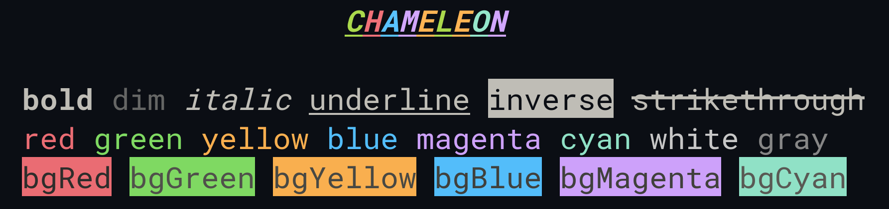

# chameleon

🦎 Terminal string styling for zig.

*Currently the only fully featured terminal color solution for zig. ⚡*

- Expressive API
- Highly performant
- Ability to nest styles
- Ability for custom themes
- No dependencies
- Clean and focused
- Truecolor support
- 140+ built in color presets




## Installation

> Chameleon supports only zig **master** branch.

- Install the package.

  ```bash
  zig fetch --save git+https://github.com/tr1ckydev/chameleon
  ```

- Add the package in `build.zig`.

  ```zig
  const cham = b.dependency("chameleon", .{});
  exe_mod.addImport("chameleon", cham.module("chameleon"));
  ```

- Import it in your project.

  ```zig
  const Chameleon = @import("chameleon");
  ```


## Usage

Chameleon is divided into two APIs — **Comptime** and **Runtime**.

- **Comptime:** The comptime API is simplest way to implement colors in your terminal.
- **Runtime:** The runtime API is much more flexible and is the recommended way when building for production.

At the end, choose what fits best for your use case.


## Documentation

Check out the full documentation [here](https://github.com/tr1ckydev/chameleon/blob/main/DOCUMENTATION.md).


## `NO_COLOR` support

> According to [no-color.org](https://no-color.org/), *"Command-line software which adds ANSI color to its output by default should check for a `NO_COLOR` environment variable that, when present and not an empty string (regardless of its value), prevents the addition of ANSI color."*
>

Chameleon supports this standard only in it's **Runtime API** by detecting the presence of the *NO_COLOR* environment variable (regardless of it's value), if present disables any ANSI colors or styles, and can also be configured to not do so if you want to implement a different way of detection, although highly not recommended.


## License

This repository uses the MIT License. Check [LICENSE](https://github.com/tr1ckydev/chameleon/blob/main/LICENSE) for full license text.
