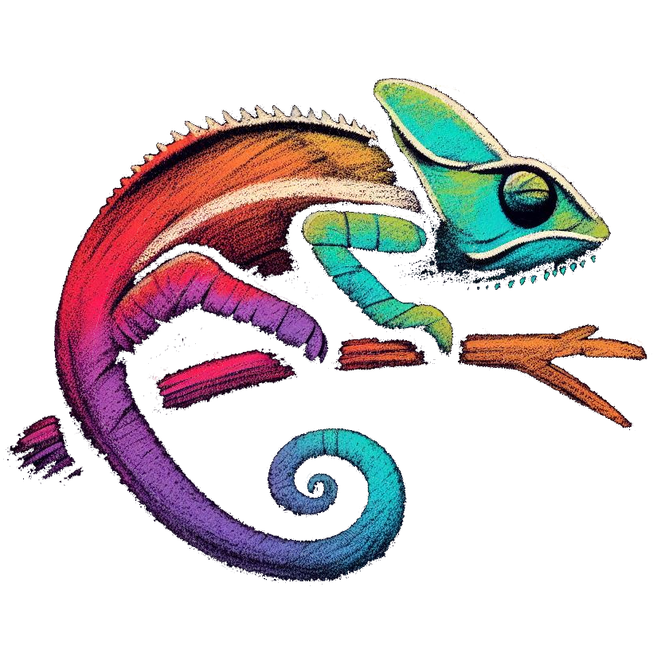

<p align="center">
	
</p>

# chameleon

🦎 Terminal string styling for zig.

Heavily inspired from [chalk](https://github.com/chalk/chalk/).


- Expressive API
- Entirely in comptime
- Ability to nest styles
- Clean and focused
- Truecolor support

Coming soon...
- Auto detect color support
- Ansi, Ansi256 color support


## Usage

```zig
const print = @import("std").debug.print;
const Chameleon = @import("chameleon").Chameleon;

pub fn main() void {
    comptime var cham = Chameleon.init(.Auto);
    print(cham.green().fmt("Hello, world!"), .{});
}
```

Chameleon comes with an easy to use composable API where the styles can be easily chained and nested.

```zig
// Combine multiple styles using chainable API
print(cham.blue().bgRed().bold().fmt("Hello, world!"), .{});

// Nest styles using string substitution
print(cham.red().fmt("Hello, {s}"), .{cham.underline().bgBlue().fmt("world!")});

// Using styled and normal strings using comptime concatenation
print(cham.blue().fmt("Hello, ") ++ "world" ++ cham.red().fmt("!"), .{});

// Using multiline strings
print(
    \\CPU:  {s}
    \\RAM:  {s}
    \\DISK: {s}
, .{
    cham.red().fmt("90%"),
    cham.green().fmt("10%"),
    cham.yellow().fmt("40%"),
});

// Using RGB colors in terminal
print(cham.rgb(219, 24, 53).underline().fmt("Underlined reddish color"), .{});
print(cham.hex("#5F4E4E").bold().fmt("Bold gray!"), .{});
```

Easily define your own themes.

```zig
comptime var panic = cham.red().bold();
print(panic.fmt("This is a panic!"), .{});

comptime var warning = cham.hex("#FFA500").italic();
print(warning.fmt("This is a warning!"), .{});

comptime var success = cham.rgb(0, 255, 0).underline();
print(success.fmt("This is a success!"), .{});
```


## Installation

1. Add the dependency to the `build.zig.zon` of your project.

   ```zig
   .dependencies = .{
       .chameleon = .{
           .url = "https://github.com/tr1ckydev/chameleon/archive/3d7fdd61598edecacd2c53c5ecff76a79abb8661.tar.gz",
           .hash = "1220018d65a2105db410846019d23fd9966ace9f5cacc2fdec5c1ad4275009b94b70",
       },
   },
   ```

2. Add the dependency and module to your `build.zig`.

   ```zig
   const cham_dep = b.dependency("chameleon", .{});
   const cham_mod = cham_dep.module("chameleon");
   exe.addModule("chameleon", cham_mod);
   ```

3. Import it inside your project.

   ```zig
   const Chameleon = @import("chameleon").Chameleon;
   ```


## Documentation

- ### Chameleon.init(`color_level`)

  ```zig
  comptime var cham = Chameleon.init(.Auto);
  ```

  Create a new Chameleon instance with the specified `color_level`.

  - `.Auto`: Auto detect color level support. (*Currently defaults to **.TrueColor** as color detection isn't supported yet*.)
  - `.Disabled`: All colors are disabled.
  - *`.BasicColor`: Basic color support (16 colors).
  - *`.Color256`: 256 colors support.
  - `.TrueColor`: 16 million colors support.

  > `*` means not implemented yet.

- ### cham.`<style>()[.<style>()...]`.fmt(`text`)

  ```zig
  cham.green().bold().underline().fmt("Hello, world!")
  ```

  Chain styles one after the other and call the `fmt` method at last with the text argument to render the styled text. Order doesn't matter, and later styles take precedent in case of a conflict. This simply means that `cham.red().yellow().green()` is equivalent to `cham.green()`.


## Styles

### Modifiers

- `reset` - Reset the current style.
- `bold` - Make the text bold.
- `dim` - Make the text have lower opacity.
- `italic` - Make the text italic. *(Not widely supported)*
- `underline` - Put a horizontal line below the text. *(Not widely supported)*
- `overline` - Put a horizontal line above the text. *(Not widely supported)*
- `inverse`- Invert background and foreground colors.
- `hidden` - Print the text but make it invisible.
- `strikethrough` - Put a horizontal line through the center of the text. *(Not widely supported)*
- `visible`- Print the text only when `color_level` isn't `.Disabled`. Can be useful for things that are purely cosmetic.

### Foreground colors

- `black`
- `red`
- `green`
- `yellow`
- `blue`
- `magenta`
- `cyan`
- `white`
- `blackBright` (alias: `gray`, `grey`)
- `redBright`
- `greenBright`
- `yellowBright`
- `blueBright`
- `magentaBright`
- `cyanBright`
- `whiteBright`

### Background colors

- `bgBlack`
- `bgRed`
- `bgGreen`
- `bgYellow`
- `bgBlue`
- `bgMagenta`
- `bgCyan`
- `bgWhite`
- `bgBlackBright` (alias: `bgGray`, `bgGrey`)
- `bgRedBright`
- `bgGreenBright`
- `bgYellowBright`
- `bgBlueBright`
- `bgMagentaBright`
- `bgCyanBright`
- `bgWhiteBright`

### Truecolor colors

Chameleon currently supports Truecolor (16 million colors) as Ansi and Ansi256 color support isn't available yet.

- `rgb`: Example - `cham.rgb(255, 136, 0).fmt("Orange!")`
- `bgRgb`: Example - `cham.bgRgb(255, 136, 0).fmt("Orange background!")`
- `hex`: Example - `cham.hex("#FF8800").fmt("Orange!")`
- `bgHex`: Example - `cham.bgHex("#FF8800").fmt("Orange background!")`

> **Note**
>  Hex codes are accepted with or without a `#` prefix. This means `cham.hex("#FF8800")` is same as `cham.hex("ff8800")`.


## Windows

If you're on Windows, do yourself a favor and use [Windows Terminal](https://github.com/microsoft/terminal/) instead of `cmd.exe`.


## Credits

This project is hugely inspired from the [chalk](https://github.com/chalk/chalk/) project from where multiple portions have been directly ported to zig. Thanks to the chalk maintainers and all the contributors.


## License

This repository uses MIT License. See [LICENSE](https://github.com/tr1ckydev/chameleon/blob/main/LICENSE) for full license text.

*chalk*: `MIT License Copyright (c) Sindre Sorhus <sindresorhus@gmail.com> (https://sindresorhus.com)`
